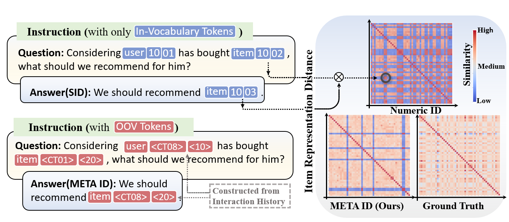

<div align="center">
  </a>
</div>


&nbsp;

<div align="center">
    .svg?style=for-the-badge" alt="Generic badge", height="21">
</div>
<h3 align="center">
    <p>
        Improving LLMs for Recommendation
        with Out-Of-Vocabulary Tokens (ICML 2025)
    <p>
</h3>
<h4 align="center">
    <p>
        📑 <a href="https://openreview.net/pdf?id=cerqDkPLx7">[Paper]</a> [<b>Code</b>]</a>
    <p>

</h4>

We introduce a <b>token construction framework for LLM-based recommender</b> systems using out-of-vocabulary (OOV) tokens to represent users and items. By clustering historical interactions, we assign shared tokens to similar entities, improving memorization and user-item distinction. This enhances downstream recommendation performance.


&nbsp;
<!-- 
## Table of Contents
- [Table of Contents](#table-of-contents)
- [Zero-shot Forecasting Performance](#zero-shot-forecasting-performance)
- [Code Implementation](#code-implementation)
- [Reproduce for Other Baseline Methods](#reproduce-for-other-baseline-methods)
- [Contributing](#contributing)

&nbsp; -->

## Sequential Recommendation Performance

Performance comparison of different methods on sequential recommendation task. META ID(T) and META ID(L) refer to the use of T5 and LLaMA2-7b as the backbone. We denote the best-performing results in **bold**.

| Methods        | Sports H@5 | Sports N@5 | Sports H@10 | Sports N@10 | Beauty H@5 | Beauty N@5 | Beauty H@10 | Beauty N@10 | Toys H@5 | Toys N@5 | Toys H@10 | Toys N@10 |
|----------------|------------|------------|-------------|-------------|-------------|-------------|--------------|--------------|----------|-----------|------------|-------------|
| Caser          | 0.0116     | 0.0072     | 0.0194      | 0.0097      | 0.0205      | 0.0131      | 0.0347       | 0.0176       | 0.0166   | 0.0107    | 0.0270     | 0.0141      |
| HGN            | 0.0189     | 0.0120     | 0.0313      | 0.0159      | 0.0325      | 0.0206      | 0.0512       | 0.0266       | 0.0321   | 0.0221    | 0.0497     | 0.0277      |
| GRU4Rec        | 0.0129     | 0.0086     | 0.0204      | 0.0110      | 0.0164      | 0.0099      | 0.0283       | 0.0137       | 0.0097   | 0.0059    | 0.0176     | 0.0084      |
| BERT4Rec       | 0.0115     | 0.0075     | 0.0191      | 0.0099      | 0.0203      | 0.0124      | 0.0347       | 0.0170       | 0.0116   | 0.0071    | 0.0203     | 0.0099      |
| FDSA           | 0.0182     | 0.0122     | 0.0288      | 0.0156      | 0.0267      | 0.0163      | 0.0407       | 0.0208       | 0.0228   | 0.0140    | 0.0381     | 0.0189      |
| SASRec         | 0.0233     | 0.0154     | 0.0350      | 0.0192      | 0.0387      | 0.0249      | 0.0605       | 0.0318       | 0.0463   | 0.0306    | 0.0675     | 0.0374      |
| S³-Rec         | 0.0251     | 0.0161     | 0.0385      | 0.0204      | 0.0387      | 0.0244      | 0.0647       | 0.0327       | 0.0443   | 0.0294    | 0.0700     | 0.0376      |
| CL4SRec        | 0.0219     | 0.0136     | 0.0358      | 0.0182      | 0.0330      | 0.0201      | 0.0546       | 0.0270       | 0.0427   | 0.0244    | 0.0617     | 0.0305      |
| TIGER          | 0.0264     | 0.0181     | 0.0400      | 0.0225      | 0.0454      | 0.0320      | 0.0648       | 0.0384       | 0.0521   | 0.0371    | 0.0712     | 0.0412      |
| RID            | 0.0208     | 0.0122     | 0.0288      | 0.0153      | 0.0213      | 0.0178      | 0.0479       | 0.0277       | 0.0044   | 0.0029    | 0.0062     | 0.0035      |
| SID            | 0.0223     | 0.0173     | 0.0294      | 0.0196      | 0.0404      | 0.0229      | 0.0609       | 0.0573       | 0.0050   | 0.0031    | 0.0088     | 0.0043      |
| CID            | 0.0269     | 0.0196     | 0.0378      | 0.0231      | 0.0336      | 0.0227      | 0.0507       | 0.0281       | 0.0172   | 0.0109    | 0.0279     | 0.0143      |
| META ID (T)    | **0.0322** | **0.0223** | **0.0487**  | **0.0277**  | __0.0510__  | __0.0351__  | __0.0753__   | __0.0432__   | **0.0533** | **0.0372** | **0.0761**  | **0.0441**  |
| META ID (L)    | __0.0302__ | __0.0278__ | __0.0561__  | __0.0332__  | **0.0458**  | **0.0320**  | **0.0678**   | **0.0360**   | __0.0524__ | __0.0364__ | __0.0535__  | __0.0312__  |


More results can be found in the paper.

&nbsp;

## Code Implementation

- Set up the environment (Please make sure the [torch](https://pytorch.org/get-started/previous-versions/) version and peft vesion is compatible with the GPU):
    ```bash
    pip install -r requirements.txt
    ```

- We provide example code for Beauty dataset with T5-backbone. More data can be found [here](https://github.com/Tingji2419/META-ID/tree/main/data/Beauty#readme)

- Run the code for META ID:
    ```shell
    bash generate_dataset-meta.sh
    cd command-final
    bash Beauty_t5_metapath_linear.sh
    ```
The results will be displayed on the screen.
&nbsp;


## Reproduce for Other Baseline Methods

- Please refer to the command for SID/CID/RID:
    ```shell
    cd command-final
    bash baselines.sh
    ```


&nbsp;

## Citing META ID

```latex
@article{huangICML25,
  author       = {Ting{-}Ji Huang and
                  Jia{-}Qi Yang and
                  Chunxu Shen and
                  Kai{-}Qi Liu and
                  De{-}Chuan Zhan and
                  Han{-}Jia Ye},
  title        = {Improving LLMs for Recommendation with Out-Of-Vocabulary Tokens},
  journal      = {CoRR},
  volume       = {abs/2406.08477},
  year         = {2024},
}
```


